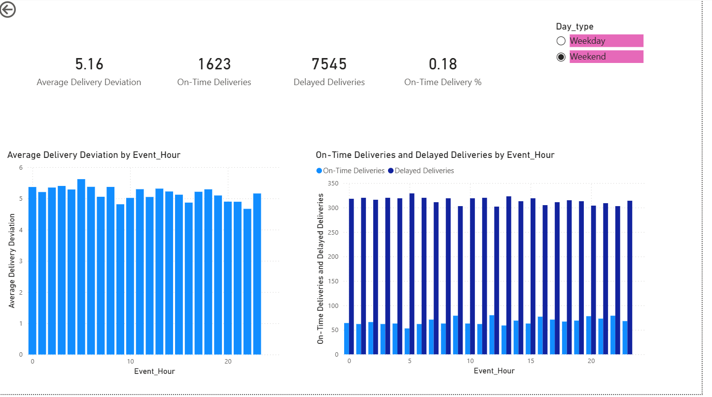

# powerbi-supply-chain-delivery-analysis
End to end Power BI dashboard analyzing supply chain delivery performance
# Supply Chain Delivery Performance Analysis (Power BI)

## 📌 Project Overview
This project analyzes delivery performance and logistics delays using Power BI.
The goal is to understand when and how delivery delays occur and measure on-time delivery efficiency.

---

## 📂 Data Source
Public supply chain logistics dataset sourced from Kaggle.
The dataset simulates real-world logistics data with timestamp-based delivery events.

---

## 🛠️ Tools Used
- Power BI Desktop
- Power Query
- DAX
- CSV / Excel

---

## 🔄 Data Preparation
- Cleaned raw logistics data
- Split timestamp into date, hour, and day attributes
- Created weekday vs weekend classification
- Ensured correct data types for analysis

---

## 📊 KPIs & Measures
- On-Time Deliveries
- Delayed Deliveries
- On-Time Delivery Percentage
- Average Delivery Deviation

---

## 📈 Dashboard Highlights
- KPI cards for overall delivery health
- Hour-wise analysis of delivery deviation
- On-time vs delayed delivery impact by hour
- Interactive weekday/weekend slicer

---

## 🔍 Key Insights
- Delivery delays vary significantly by hour
- Certain hours show higher delay impact
- Weekday and weekend delivery performance differs

---

## 📷 Dashboard Preview

---

## 🚀 Future Enhancements
- Day-wise performance page
- SLA-based delivery thresholds
- Inventory and demand analytics extension
