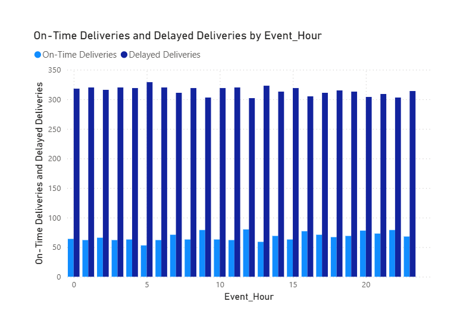

# Supply Chain Delivery Performance Analysis (Power BI)

## Project Overview
This project is an **end-to-end Power BI analytics solution** designed to analyze
**delivery performance and logistics delays** in a supply chain environment.

The objective of this project is to transform raw logistics data into
**actionable business insights** by answering key operational questions such as:
- How reliable are deliveries overall?
- At which hours of the day do delays occur most frequently?
- How many deliveries are impacted, not just how large the average delay is?
- Does delivery performance differ between weekdays and weekends?

---

## Project Workflow
1. Selected a public supply chain logistics dataset
2. Cleaned and transformed raw data using Power Query
3. Engineered time-based features from timestamp data
4. Designed DAX measures for delivery KPIs
5. Built an interactive Power BI dashboard
6. Added slicers for comparative analysis (weekday vs weekend)

---

## Data Source
- **Source:** Public supply chain logistics dataset from Kaggle  
- **Format:** CSV  

### Dataset includes:
- Delivery event timestamps  
- Delivery time deviation (planned vs actual delivery time)  
- Time-based operational patterns  
- Realistic logistics behavior similar to ERP and transportation systems  

> The dataset reflects real-world scenarios where delivery data is stored as
timestamp-based records, requiring time feature engineering.

---

## Tools & Technologies
- Power BI Desktop
- Power Query (data cleaning and transformation)
- DAX (measures and KPIs)
- CSV / Excel

---

## Data Preparation
Key data preparation steps performed in Power Query:
- Cleaned and validated raw logistics data
- Split timestamp into:
  - Event Date
  - Event Hour (0–23)
  - Day Name
  - Day Type (Weekday / Weekend)
- Ensured correct data types for accurate calculations

---

## KPIs & Measures
All KPIs were implemented as **DAX measures** to ensure dynamic behavior
across filters and visuals.

### KPI Logic
- **On-Time Deliveries:** Delivery Time Deviation ≤ 0  
- **Delayed Deliveries:** Delivery Time Deviation > 0  
- **On-Time Delivery %:** On-Time Deliveries / Total Deliveries  
- **Average Delivery Deviation:** Average deviation from planned delivery time  

Using measures instead of columns ensures all KPIs respond correctly to slicers
and visual interactions.

---

## Dashboard Design
The dashboard is structured to provide a clear analytical flow:

### KPI Summary (Top Section)
- On-Time Delivery %
- Average Delivery Deviation
- On-Time Deliveries count
- Delayed Deliveries count  

Provides a quick snapshot of overall delivery health.

### Hour-wise Performance Analysis (Middle Section)
- Average delivery deviation by hour
- On-time vs delayed deliveries by hour  

Helps identify peak delay windows and their operational impact.

### Interactivity
- Weekday / Weekend slicer to compare delivery performance patterns

---

## Dashboard Preview

### Full Dashboard View  
Overview of delivery KPIs and hourly performance patterns  

### Hour-wise Delivery Analysis  
On-time vs delayed deliveries across different hours of the day  

---

## Key Insights
- Delivery performance varies significantly by **hour of the day**
- Certain time windows show higher delay impact even when average deviation is moderate
- Weekday and weekend delivery behavior differs noticeably
- Analyzing delivery counts reveals operational impact better than averages alone

---

## Business Impact
This dashboard helps logistics and operations teams:
- Identify peak hours causing delivery delays
- Quantify how many deliveries are impacted
- Compare weekday vs weekend performance
- Support better staffing, routing, and scheduling decisions

---

## Learning Outcomes
Through this project, I strengthened my skills in:
- Power BI data modeling best practices
- Writing robust DAX measures (measures vs columns)
- Designing executive-ready dashboards
- Translating business problems into analytical KPIs

---

## Power BI File
The `.pbix` file is not included to keep the repository lightweight.
It can be shared upon request.

---

## Future Enhancements
- Add day-of-week (Monday–Sunday) performance analysis
- Introduce SLA-based delivery thresholds
- Extend analysis to inventory or demand planning metrics

---

## Contact
If you’d like to discuss this project or similar analytics work:
- **LinkedIn:** 

 If you found this project useful, consider starring the repository.

